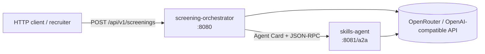
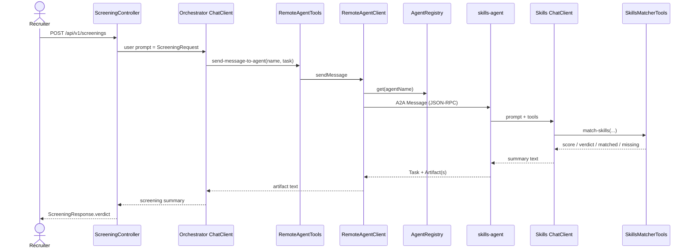

# Architecture

**Audience:** developers extending or debugging this exercise.  
**Status:** current as of the repo layout under `skills-agent/` and `screening-orchestrator/`.

## 1. Context

A recruiter (or any HTTP client) posts candidate + job details to the **screening orchestrator**. The orchestrator does not score skills itself. It discovers a remote **Skills Matcher** agent over A2A, asks that agent to compare skills, then asks the local LLM to write a short screening summary.



Assumptions the diagram does not show: both apps need `OPENROUTER_API_KEY`; the orchestrator loads Agent Cards **at startup** and fails fast if the skills agent is unreachable.

## 2. Goals and constraints

| Goal | Constraint |
| --- | --- |
| Clear A2A client ↔ server loop | Exactly one remote specialist in the default setup |
| Runnable locally and in Docker | Agent Card `url` must be reachable from the client process |
| Easy to inspect scores | Skills matching is a Java `@Tool`, not pure LLM invention |
| Java 26 / Boot 4.1 / Spring AI 2 | Uses community `spring-ai-a2a` server autoconfigure `0.3.0` |

## 3. Components

### 3.1 `skills-agent` (A2A server)

| Piece | Responsibility |
| --- | --- |
| `config.SkillsAiConfiguration` | `ChatClient` + system prompt |
| `config.SkillsA2aConfiguration` | `AgentCard` + `AgentExecutor` |
| `domain.SkillsMatcher` | Deterministic skill overlap scoring |
| `tools.SkillsMatcherTools` | Spring AI `@Tool` adapter over the domain |
| spring-ai-a2a autoconfig | Serves Agent Card + JSON-RPC under `/a2a` |

### 3.2 `screening-orchestrator` (A2A client + REST)

| Piece | Responsibility |
| --- | --- |
| `api.ScreeningController` | Public REST: `POST /api/v1/screenings` |
| `application.ScreeningService` | Screening use case (thin orchestration over ChatClient) |
| `a2a.AgentRegistry` | Fetches Agent Cards at startup |
| `a2a.RemoteAgentClient` | A2A SDK send + wait for artifacts |
| `a2a.tools.RemoteAgentTools` | `send-message-to-agent` tool for the LLM |
| `config.OrchestratorAiConfiguration` | Orchestrator `ChatClient` wiring |
## 4. Request flow



### Happy-path outcomes

For the sample payload in [api.md](api.md):

- Required: `Java, Spring Boot, AWS, Kafka`
- Candidate: `Java, Spring Boot, Azure, Kafka`
- Tool score: **75** → `STRONG_MATCH`, missing `aws`

The orchestrator LLM should incorporate that into a short prose verdict (wording varies by model).

## 5. Deployment views

### 5.1 Local JVM (two processes)

```text
Host
├── screening-orchestrator  http://localhost:8080
└── skills-agent            http://localhost:8081/a2a
        Agent Card url → http://localhost:8081/a2a/
```

### 5.2 Docker Compose

```text
Compose network: a2a
├── screening-orchestrator  published :8080
│     SKILLS_AGENT_URL=http://skills-agent:8081/a2a
└── skills-agent            published :8081
      A2A_AGENT_PUBLIC_URL=http://skills-agent:8081/a2a/
      HEALTHCHECK → Agent Card
```

**Critical:** the Agent Card’s `url` field is what the A2A client uses to send messages. In Docker it must be the **service DNS name** (`skills-agent`), not `localhost`. See [configuration.md](configuration.md).

## 6. Package layout

```text
skills-agent/.../skills/
  SkillsAgentApplication.java
  config/     SkillsAiConfiguration, SkillsA2aConfiguration, SkillsAgentProperties
  domain/     SkillsMatcher, SkillsMatchResult, MatchVerdict
  tools/      SkillsMatcherTools (@Tool adapter)

screening-orchestrator/.../orchestrator/
  ScreeningOrchestratorApplication.java
  api/          ScreeningController, ScreeningApiExceptionHandler, dto/
  application/  ScreeningService
  a2a/          AgentRegistry, RemoteAgentClient, ArtifactTextExtractor
  a2a/tools/    RemoteAgentTools
  config/       OrchestratorAiConfiguration, RemoteAgentsProperties
```

Layering rules:

| Layer | May depend on |
| --- | --- |
| `api` | `application`, DTOs |
| `application` | Spring AI `ChatClient`, DTOs |
| `a2a` | A2A SDK, `config` properties |
| `domain` (skills) | nothing framework-specific except Spring `@Service` for DI |
| `tools` / `config` | domain + framework types |
## 7. Extension points

| Change | Where to start |
| --- | --- |
| Add another specialist agent | New Spring Boot module + A2A server beans; append URL under `remote.agents.urls` |
| Change scoring rules | `SkillsMatcherTools` (+ unit tests) |
| Change recruiter API shape | `ScreeningRequest` / `ScreeningResponse` / controller |
| Swap chat model | Change `OPENROUTER_CHAT_MODEL` (OpenRouter model id) |

## 8. Related docs

- Protocol detail: [a2a-protocol.md](a2a-protocol.md)
- Operations: [runbook.md](runbook.md)
- Config: [configuration.md](configuration.md)
