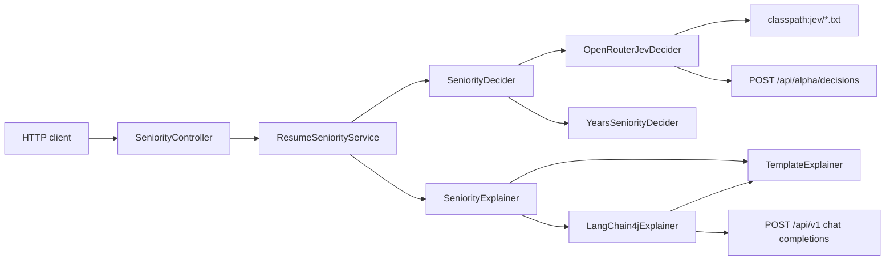
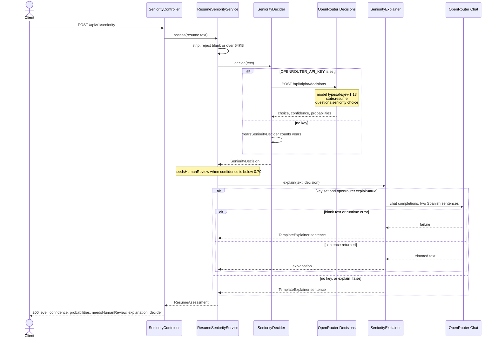

# Architecture

## Flow

```text
POST /api/v1/seniority
        │
        ▼
SeniorityController
        │  resume text, or a .txt path inside the working directory
        ▼
ResumeSeniorityService
        │
        ├── SeniorityDecider.decide(text)
        │         │
        │         ├── OpenRouterJevDecider     when OPENROUTER_API_KEY is set
        │         └── YearsSeniorityDecider    otherwise
        │
        └── SeniorityExplainer.explain(text, decision)
                  │
                  ├── LangChain4jExplainer     key set and openrouter.explain=true
                  └── TemplateExplainer        otherwise, or if the chat call fails
        │
        ▼
ResumeAssessment
  level, confidence, probabilities, needsHumanReview, explanation, decider
```

The explainer receives a decision that is already made. Its prompt says not to change the level. A chat-model failure does not fail the HTTP call: the service still returns the Jev (or offline) label and a template sentence.

`needsHumanReview` is local. It is true when `confidence < app.human-review-below` (default `0.70`). Jev is not asked a second question for that flag.

## Components

`ClientConfig` picks one `SeniorityDecider` and one `SeniorityExplainer` at startup. The service depends on those ports, not on OpenRouter types.



`YearsSeniorityDecider` does not read the criteria files. `LangChain4jExplainer` calls `TemplateExplainer` when the chat model returns blank text or throws. `DemoRunner` calls the same service for each file in `SampleResumes` when `app.demo=true`.

## Sequence

One `POST /api/v1/seniority`. The label is fixed before anyone writes a sentence.



A Decisions HTTP error, timeout, unknown choice, or confidence outside 0 to 1 becomes `JevClientException`. The API returns 502. The chat failure path above does not.

## Why two clients

Jev is a decision model. It returns a typed choice and probabilities. It does not return prose. A chat completion is a poor fit for the label, because the app would have to parse free text. A decision model is a poor fit for the paragraph, because it does not write one.

| Concern | Jev | Chat model |
|---|---|---|
| Endpoint | `https://openrouter.ai/api/alpha/decisions` | `https://openrouter.ai/api/v1` (OpenAI-compatible) |
| Client | Spring `WebClient` | LangChain4j `OpenAiChatModel` |
| Output the app keeps | `choice`, `confidence`, `probabilities` | trimmed Spanish text |
| Used in `./gradlew check` | no; `MockWebServer` replays a fixture | no; a fake `ChatModel` |

Both live calls use the same `OPENROUTER_API_KEY`. There is no TypeSafe account.

## Beans

`ClientConfig` chooses the implementations once at startup:

| Bean | Key missing | Key present |
|---|---|---|
| `SeniorityDecider` | `YearsSeniorityDecider` | `OpenRouterJevDecider` |
| `SeniorityExplainer` | `TemplateExplainer` | `LangChain4jExplainer`, unless `openrouter.explain=false` |
| `WebClient` | still created; unused by the offline decider | base URL `openrouter.base-url`, connect timeout 5s, response timeout 20s |

The decider id is part of the response: `offline-years` or `jev`.

## Startup demo

`DemoRunner` runs when `app.demo=true` (the default). It classifies every file registered in `SampleResumes` and logs the level, confidence, review flag, and decider. It does not log the resume text.

Tests set `app.demo=false` so the context does not classify samples during the suite. With a real key, a demo startup does call OpenRouter three times.

## What is intentionally out of scope

- PDF or DOCX parsing. Input is plain text.
- A second choice question for job fit. The same Decisions body can carry one; this lab only sends `seniority`.
- Persisting assessments.
- Authentication on the local API. The lab listens on localhost.
