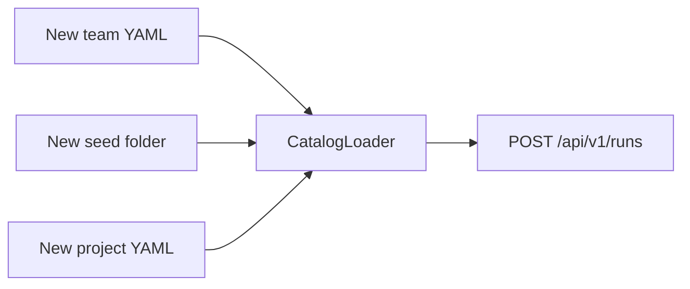

# Adding a team or a technology

No Java change is required for a new team composition or a new stack. Restart the app so `CatalogLoader` re-reads YAML.

## New team

1. Copy `config/teams/default-scrum-team.yaml`.
2. Set a unique `id`.
3. Keep only the roles you want. Unknown `kind` values fail startup.
4. Point each `prompt` at a file under `prompts/`.
5. Use `${MODEL_FAST}` / `${MODEL_STRONG}` or pin a slug.
6. Set `policy` loop caps and `stakeholderMode` (`AGENT` or `HUMAN`).

`POST /api/v1/runs` then uses `"teamId": "your-id"`.

Lean example: [config/teams/lean-pair.yaml](../config/teams/lean-pair.yaml). Fastest smoke: [config/teams/dev-only.yaml](../config/teams/dev-only.yaml). HITL: [config/teams/hitl-lean.yaml](../config/teams/hitl-lean.yaml).

A new **role kind** (not just a new YAML composition) is a Java change: [adding-a-role.md](adding-a-role.md).

## New technology

1. Add `seeds/<id>/` that builds with a local command (Gradle wrapper, `npm test`, …).
2. Add `config/projects/<id>.yaml`:

```yaml
id: my-service
seed: seeds/my-service
repoPath: workspace/my-service
branchPrefix: feature/
sourceGlobs:
  - "src/**"
  - "test/**"
conventions: docs/conventions/my-stack.md
commands:
  test: ["./gradlew", "test", "--console=plain"]
timeoutSeconds: 600
```

Rules:

- `commands.*` must be argv arrays.
- `repoPath` must stay under `workspace/` or startup fails.
- `seed` must exist as a directory.

3. `./scripts/seed-workspace.sh <id>`
4. `"projectId": "my-service"` on `POST /api/v1/runs`.

## Diagram



Dashboard create vs YAML-on-disk: [sequences.md](sequences.md) §2.
