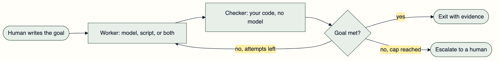
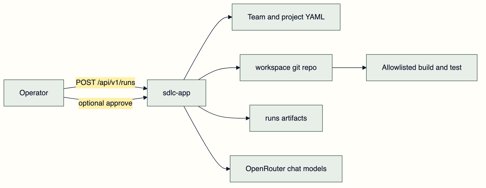
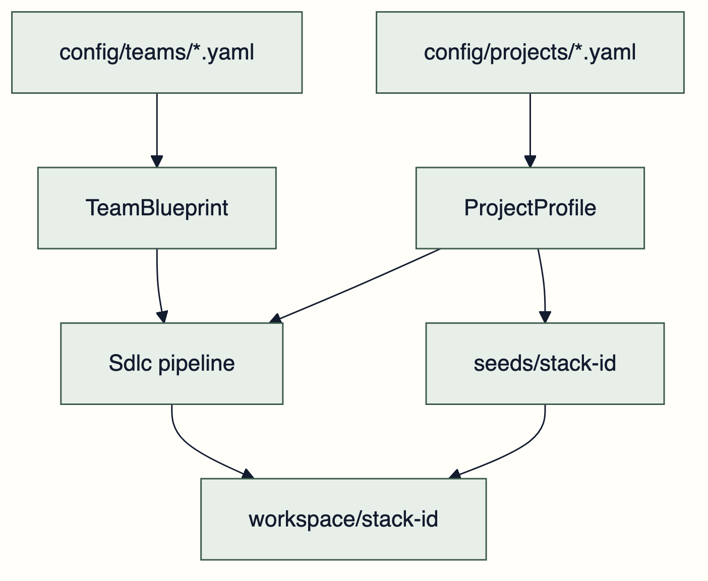
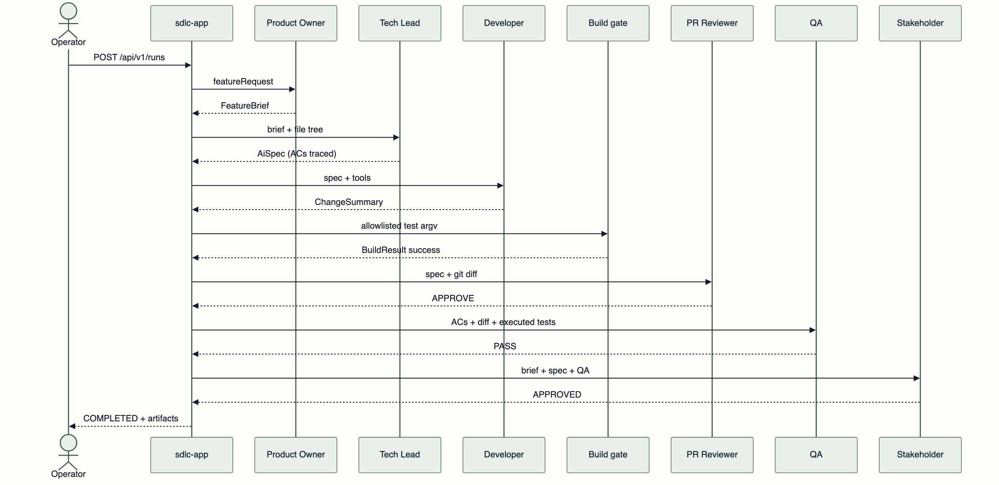
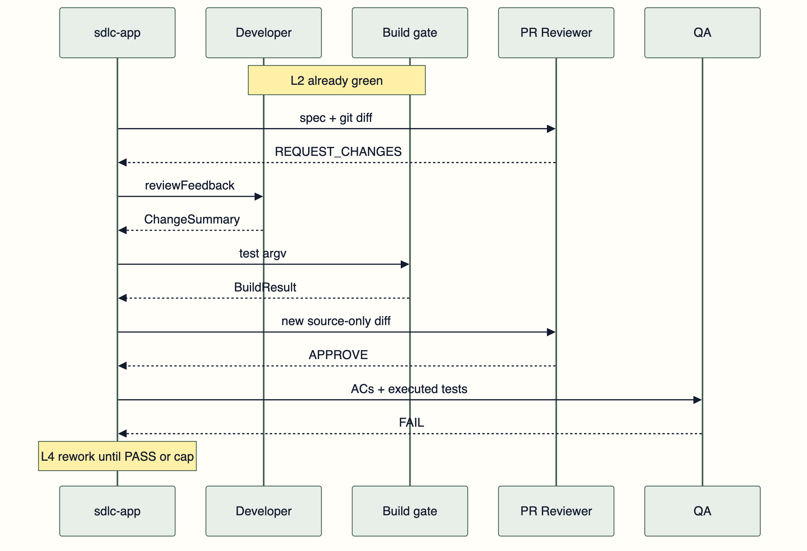

# A Goal the Agent Cannot Fake

I did not build this to replace anyone. I built it because I wanted somewhere to be wrong about agents where being wrong is free.

The playground is six LLM roles pointed at a real git repository. Product Owner, Tech Lead, Developer, PR Reviewer, QA, Stakeholder. Java 26, Spring Boot 4.1, LangChain4j 1.18. The Developer edits files. A deterministic gate runs the project's own test command. The reviewer reads an actual git diff.

It does not open pull requests on your service. It does not talk to your issue tracker. It does not deploy. Those are not missing features, they are the boundary that makes the sandbox worth having.

The roles are a familiar shape to hang a workflow on, nothing more. What I actually walked away with is smaller than "an AI team" and far more reusable: two primitives, a GOAL and a LOOP, that change how any personal project uses an agent.

## GOAL and LOOP

Every agent demo I have enjoyed and then quietly abandoned had the same hole. The agent decides when it is finished.

That works right up until it does not, and you cannot tell the difference from the transcript. The model says the tests pass. The model says the docs are updated. The model says the bug is fixed. Sometimes that is true. You find out later, by hand.

A GOAL is a condition your own code evaluates. Not a rubric in a prompt, not a self-assessment, not a confidence score. Something you could assert in a unit test with the model switched off.

A LOOP is bounded iteration toward that goal. A worker attempts, a checker evaluates, and the whole thing has a cap and a name for what happens when the cap is reached.



That is the whole pattern. The interesting part is that the worker is the easiest piece to replace and the least important to get right. Swap models freely. The checker is what makes the run mean something.

## A Goal the Model Cannot Fake

In this playground the goals are typed records, because a record with a compact constructor is the cheapest place to put a rule that a model cannot argue with.

The Tech Lead cannot satisfy a brief with a convincing paragraph. `AiSpec.covers(brief)` is a plain Java check: every acceptance-criterion id appears once in traceability, with a planned test name attached. No planned test, the spec loop keeps going until the cap.

The reviewer is the same idea. Findings carry a severity, only error and blocker count, and the constructor recomputes the decision rather than trusting what the model reported:

```java
public ReviewVerdict {
    findings = findings == null ? List.of() : List.copyOf(findings);
    blockingCount = (int) findings.stream()
            .filter(ReviewFinding::blocking)
            .count();
    decision = blockingCount > 0 ? REQUEST_CHANGES : APPROVE;
}
```

QA is stricter still. If the planned test already ran on a green build, reconciliation upgrades the row. The model does not get a vote against JUnit XML:

```java
if (gate.success() && ran(planned, gate)) {
    results.add(new QaResult(criterion.id(), QaVerdict.PASS, evidence(planned, gate)));
    continue;
}
```

I have watched chat-shaped "QA agents" mark every criterion PASS and then fail the run with `score=0`. Once the verdict is a record, that contradiction becomes impossible in the constructor instead of unlikely in a prompt. Prompts still matter, and mine restate the exit condition so the model is not fighting the record. The record still wins.

## A Loop That Knows How to Quit

The implementation loop is LangChain4j `loopBuilder` with an exit condition written in Java, and a build gate that is an action rather than a chat model:

```java
return AgenticServices.loopBuilder()
        .name("implementation-loop")
        .subAgents(agents.developer(role, context, policy), buildGateAction(context))
        .maxIterations(policy.maxImplementationAttempts())
        .testExitAtLoopEnd(true)
        .exitCondition(scope -> {
            BuildResult build = RunStateFactory.read(
                    scope, StateKeys.BUILD_RESULT, BuildResult.none());
            return build.success();
        })
        .build();
```

Review and QA wrap their rework in `conditionalBuilder`, so the Developer runs again only when the previous verdict actually asked for changes.

Caps live in YAML because I wanted to tune the process without redeploying logic:

```yaml
policy:
  maxSpecRework: 2
  maxImplementationAttempts: 3
  maxReviewCycles: 3
  maxQaCycles: 3
  maxStakeholderCycles: 2
  qaPassThreshold: 80
  stakeholderMode: AGENT
```

Hitting a cap produces `ESCALATED`, which is a real outcome with artifacts attached, not a spinner that lies. An agent loop without a cap is a defect with a monthly bill.

## The Harness Around Both

The application holds no product domain. It loads a team file and a project file, copies a seed into a gitignored workspace, and runs the roles as an agentic graph. The core module has no LangChain4j and no Spring, so the records and ports can be tested with no model in the room.



Who is in the loop and what technology it runs against are separate axes on purpose. Change the roster without touching Java. Change Gradle for npm by swapping the seed and the project file.



Nested loops, each with its own goal:


## Watching a Loop Run

A run starts with `POST /api/v1/runs`. Artifacts land under `runs/<id>/`. Git commits locally and never pushes. The UI follows step events over SSE.



The happy path is the boring one. The run I learn from is the one where the goal is already met and the loop refuses to believe it:



That second diagram is the reason the playground exists. You cannot see that shape in a chat window.

## Swap the Worker, Keep the Harness

Workers are deliberately boring. The Developer is an `@Agent` interface whose tools are list, read, write, and delete inside a path jail. The prompt says plainly that running tests is not its job:

```java
@UserMessage("""
        AI spec:
        {{aiSpec}}

        Review feedback (may be empty):
        {{reviewFeedback}}

        Use listFiles, readFile, writeFile, and deleteFile.
        Do not run tests; the build gate runs the allowlisted test command after your turn.
        Return JSON for ChangeSummary.
        """)
@Agent(description = "Implements the AI spec by editing the repository",
        outputKey = StateKeys.CHANGE_SUMMARY)
ChangeSummary implement(
        @V(StateKeys.AI_SPEC) AiSpec aiSpec,
        @V(StateKeys.REVIEW_FEEDBACK) String reviewFeedback,
        @V(StateKeys.BUILD_FEEDBACK) String buildFeedback);
```

The checker on the other side is an argv array from project configuration, never a shell string the model composed:

```yaml
commands:
  build: ["./gradlew", "compileJava", "--console=plain"]
  test: ["./gradlew", "test", "--console=plain"]
  check: ["./gradlew", "check", "--console=plain"]
```

```java
if (!isAllowlisted(profile, argv)) {
    throw new CommandNotAllowedException(
            "Command argv is not allowlisted for project " + profile.id() + ": " + argv);
}
```

Tools are permissions, and permissions are the architecture. I would not give a brand new script unrestricted shell access on my laptop either.

## Other Things I Want to Put in This Loop

The roles happen to be a scrum cell because that was the shape in front of me. The pattern does not care. Anywhere you can write a checker, you can run this, and most of my personal projects have at least one checker sitting unused in the build already.

| Playground | Goal your code checks | What loops |
| --- | --- | --- |
| Docs parity | Every public type and method has a doc comment with a sample | Agent edits comments, an AST scan re-runs |
| Coverage on changed lines | JaCoCo threshold on the diff, not the whole repo | Agent adds tests, the report re-runs |
| Flaky hunter | Suite runs 20 times with identical results | Agent quarantines or fixes, the runner repeats |
| Migration rehearsal | Compile and tests green on the new toolchain | Agent patches deprecations, the build re-runs |
| Frontend budget | Accessibility violations at zero, bundle under a byte cap | Agent edits components, the audit re-runs |
| Retrieval quality | Golden question set scores above a threshold | Agent tunes chunking and prompts, the eval re-runs |
| Writing pipeline | Links resolve, style rules pass, structure is complete | Writer and editor roles, a linter decides |
| Model bake-off | One fixed goal, several models, same seed | Nothing changes but the worker |

A few of those are worth more than the rest.

The migration rehearsal is the one I keep coming back to. Moving a service across Java or Spring Boot majors is mostly a long tail of mechanical edits with a brutally clear definition of done. The build either compiles and passes or it does not. That is a goal no model can talk its way past, and a cap keeps a stubborn dependency from eating an afternoon of tokens.

The retrieval loop is the one that maps directly onto founder work. On ITJobOpportunities the scoring between a candidate profile and a job is the thing people will argue with, so the model handles messy text and my code owns the number. Same split here. Put a golden set behind a threshold, let the worker tune, and the eval decides. The model is noisy. The scorer is the product.

The bake-off is the cheapest experiment in the list and the most clarifying. Fix the goal, fix the seed, change only the model, and read attempts and wall clock. It tells you more about a model in one evening than a month of vibes, and it costs one config edit.

## What the Playground Taught Me

The feature I kept running was ordinary. Return a 404 with a problem detail when the id is unknown, and reject a blank name on create. The first Developer pass usually got it. The run still fell apart afterward, which is exactly why the exercise was worth doing.

One failure was empty reviewer content. A reasoning model put its JSON in the thinking channel, or nowhere at all, and the framework tried to parse null into a verdict. That is not a model that cannot review code. That is an output contract with no adapter behind it.

Another was the diff. Build output landed in `git add`, filled the truncated diff, and the reviewer requested changes because a controller "was not in the diff." It was in the commit. The reviewer simply never saw it.

A third was QA scoring 67 because two criteria "had no test in the log," when the XML report showed both methods had already run. Stakeholder rejected, the outer loop restarted, and expensive roles re-explained a feature that existed.

None of those needed a better model. They needed a gitignore, pathspecs, a real test report, and a reconciliation step. Once the evidence was structured, approval stopped being a personality trait of whichever model I had configured that week.

That is the honest value of a playground. Every one of those bugs is invisible in a demo and obvious in a run you can replay.

## Where the Human Is Not Optional

Someone has to write the goal, and that is not a leftover chore. It is the entire job.

Deciding that "done" means every criterion traces to a named test, that a blocking finding outranks an approving tone, that a score below the threshold means rework rather than a shrug, all of that is judgment. The loop only automates the patience required to keep checking. Work moves upstream into defining done. It does not evaporate.

There is also a clear list of things I would not put behind this pattern. Anything needing product judgment about what should exist. Security boundaries. A data migration you cannot roll back. Anywhere the cost of a wrong answer is paid by someone who never saw the run.

And the last mile stays human by design. The best outcome this playground produces is a branch with a diff, a list of executed tests, and a verdict a person can read and disagree with. Somebody still has to disagree with it.

## Start With One Goal

If you want to try this in a personal project, do not start with six roles. Start with one goal your code can check today.

Pick something already in your build. A coverage threshold. A linter with zero warnings. A schema that validates. A golden set with a score. Then write the smallest loop around it: a worker that attempts, your checker, a cap, and a clear escalation when the cap is reached.

Keep the worker replaceable and the checker precious. Log the artifacts so you can replay a run instead of remembering it. Give the loop a boring name and a hard stop.

The lesson that survived all of this is not that six personas can imitate a team. It is that an agent becomes useful the moment it stops being the source of truth for whether it succeeded.
