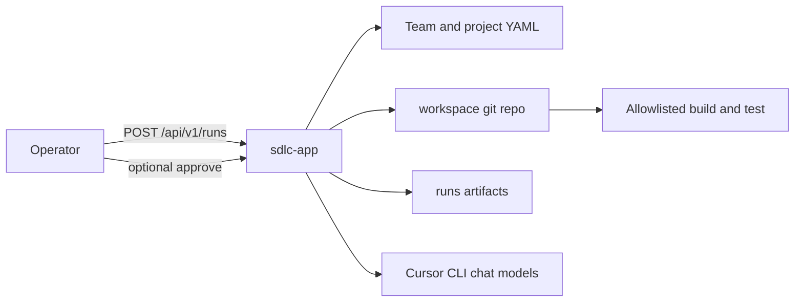
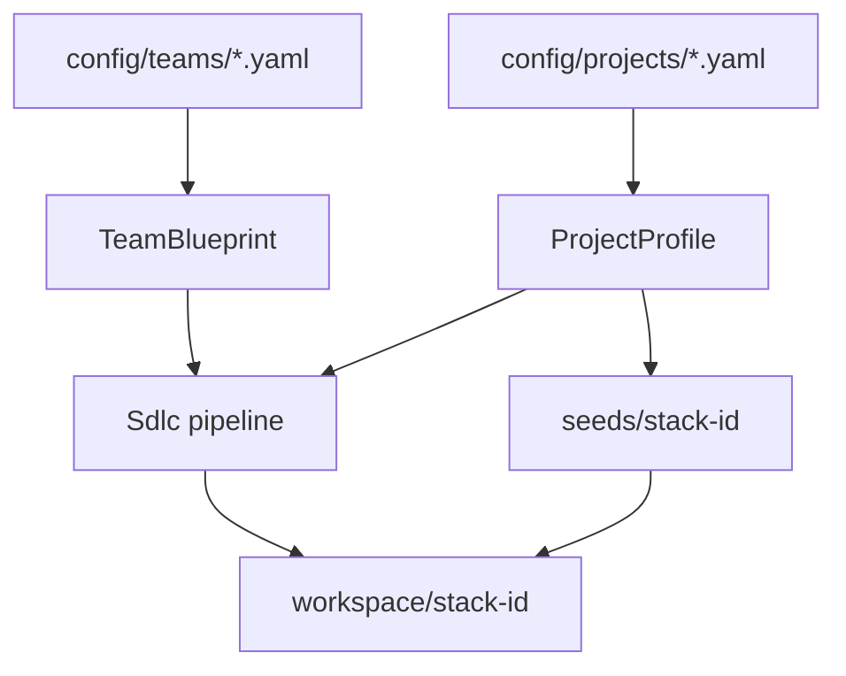
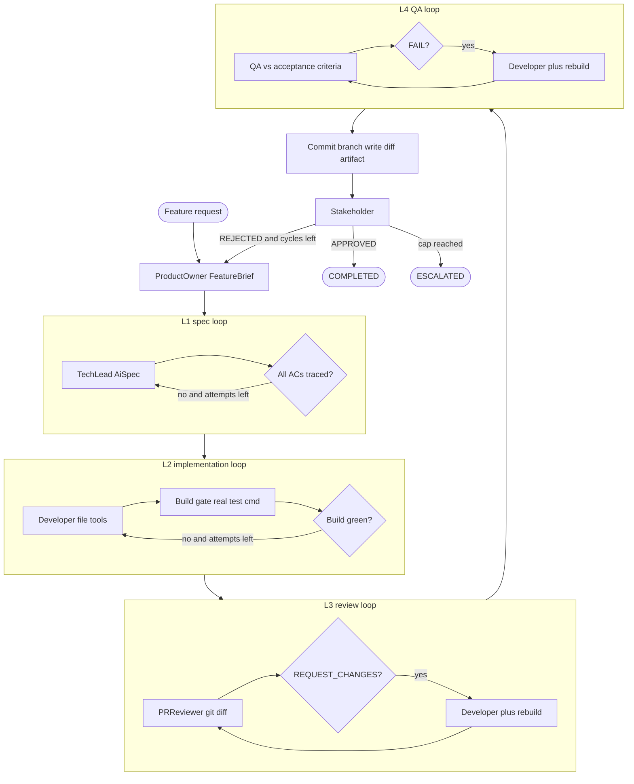
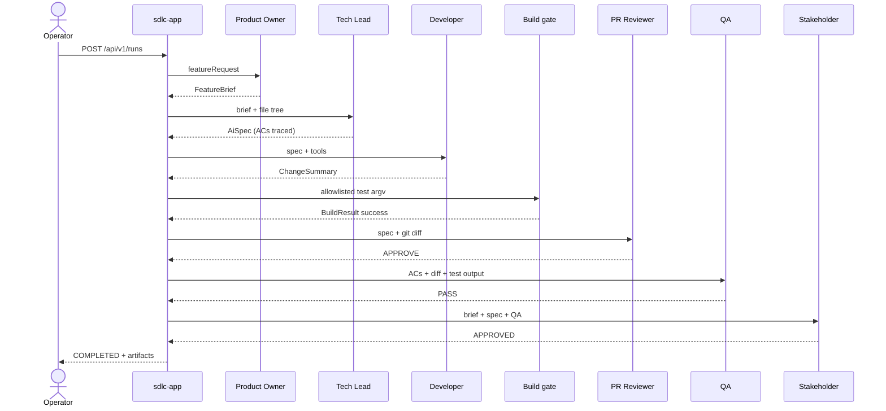
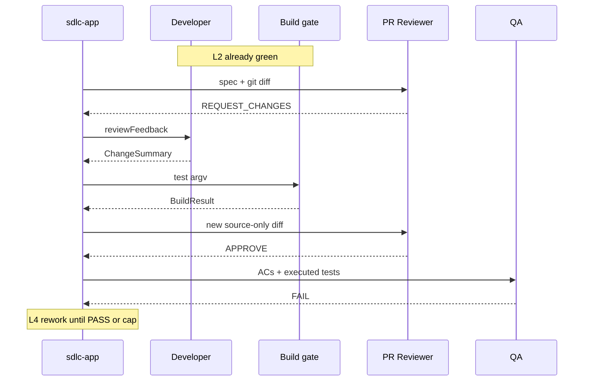

# An AI Team That Actually Ships (And Why Most Don't)

Someone asked me if I would trust six LLM roles to open a pull request on a real service. I said no, then I built the thing anyway, because "no" without a counterexample is just taste.

I have spent years watching delivery loops fail for boring reasons. Specs that never named a test. Reviews that argued about files that were not in the diff. QA that failed a green build because the log did not print the method name. None of that is an AI problem. It is a systems problem. Agents make it louder.

So I built a lab: Product Owner, Tech Lead, Developer, PR Reviewer, QA, Stakeholder. Java 26, Spring Boot 4.1, LangChain4j 1.18. The Developer writes files in a real git repo. A deterministic gate runs the project's test command. The reviewer sees a git diff, not a chat summary of one.

The point is not "agents can code." Plenty of demos can code. The point is whether the loop can stop.

## If You Need to Simulate a Team

The useful question is not "will this replace my engineers." It is whether you can put a fake scrum cell on a real repo and watch what happens when the ticket is a 404, when review asks for changes, when QA disagrees with a green build, or when stakeholder sends it back.

Chat windows cannot answer that. They do not have a Product Owner artifact, a spec loop, a test command, or a cap. You cannot replay "stakeholder rejected after QA scored 67" as a scenario. You get a conversation.

This lab is a short-to-medium-term answer if you are trying to simulate a development team and exercise those scenarios on purpose.

**Short term (this quarter).** You already have the roles, a seed that compiles, and the gates. Feed it a feature request. You get a brief, a spec with planned tests, a working tree, JUnit names, a diff, and a verdict. That is enough to demo the graph, compare models on the same ticket, and change process (caps, gitignore, reconcile) without waiting for a human sprint. The scenarios that taught me the most were not "did it code." They were empty reviewer JSON, `build/` in the diff, and QA ignoring JUnit XML.

**Medium term (this year).** Turn those runs into a scenario catalog. Same request, expected artifacts. Did the planned test run. Did the reviewer invent a file. Did stakeholder restart a finished feature. Attach the graph to a sandbox branch if you want. Still no merge to `main`. The simulation becomes a regression suite for the process, the same way I treat evals for résumé-to-job scoring on ITJobOpportunities: the model is noisy; the scenario and the score are the product.

What this is not: an autonomous employee. It will not invent product sense, design a migration you cannot roll back, or replace code review on a security boundary. Those stay human. The lab is useful because you can fail the team in a workspace instead of in production.

The rest of this piece is how the loop is wired, and why the interesting part is the code that is not a model.

## Chat Is Not a Delivery Process

Most multi-agent coding demos are a group chat with job titles. Someone "writes a spec." Someone "implements." Someone "reviews." The output is prose. You paste it into an IDE if you still care.

That is fine for a screenshot. It is not a software process.

A process has artifacts with shapes, gates that are not optional, and a cap on how many times you are allowed to argue. If the reviewer can say FAIL because the vibe is wrong, you do not have QA. You have another writer.

I already had the vocabulary for this on Agent UI Editor: sequence, parallel, conditional, supervisor. Those nodes are coordination, not intelligence. The SDLC lab is the same instinct pointed at a git working tree. The graph is YAML. The workers are roles. The interesting part is what is not a model.

## Architecture: An Orchestrator, Not a Users Service

The app does not contain the users CRUD domain. It loads a team YAML and a project YAML, copies a seed into a gitignored workspace, and runs the roles as a LangChain4j agentic graph. `sdlc-core` has no LangChain4j and no Spring. Records and ports live there so the loop can be tested without a model.

Notice the operator talks to HTTP. The workspace talks to an allowlisted test command. the Cursor CLI is a dependency, not the source of truth.



Team composition and technology are two axes on purpose. Change who is on the team without touching Java. Change Gradle versus npm by swapping the seed and the project YAML.



The pipeline is nested loops with Java exit conditions. L3 and L4 only re-run the Developer when the previous verdict asked for changes. Hit a cap and the run is `ESCALATED`, not infinite.



## Sequence: One Happy Path

A run starts with `POST /api/v1/runs`. Artifacts land under `runs/<id>/`. Git never pushes. The UI follows SSE step events, then a final `GET`.



Rework is the same sequence with extra Developer plus build-gate turns inside L3 or L4. The outer stakeholder loop is the only path that restarts the Product Owner.



Those two sequences are the scenarios I actually care about: the happy path, and the rework path after the build is already green. A team simulator that cannot show the second one is just a chat with extra steps.

## Team Composition Is Config. The Build Is Not.

Java in this lab does not mention Gradle, npm, or "users CRUD." Who is on the team lives in team YAML. Caps live in the same file, because I wanted to change them without a redeploy of business logic.

```yaml
policy:
  maxSpecRework: 2
  maxImplementationAttempts: 3
  maxReviewCycles: 3
  maxQaCycles: 3
  maxStakeholderCycles: 2
  qaPassThreshold: 80
  stakeholderMode: AGENT
```

The default team looks like a small scrum cell:

| Role | Job | Model |
| --- | --- | --- |
| Product Owner | `FeatureBrief` with Given/When/Then criteria | fast |
| Tech Lead | `AiSpec` that traces every criterion to a planned test | strong |
| Developer | file tools, then a `ChangeSummary` | strong |
| Build gate | allowlisted test argv, not an LLM | none |
| PR Reviewer | `ReviewVerdict` against the diff | strong |
| QA | `QaVerdict` against criteria plus test output | fast |
| Stakeholder | ship or send it back, with a cycle cap | fast |

The implementation loop is LangChain4j `loopBuilder` plus an `agentAction` that is not a chat model. Exit is `BuildResult.success`, not "the Developer said it was done."

```java
return AgenticServices.loopBuilder()
        .name("implementation-loop")
        .subAgents(agents.developer(role, context, policy), buildGateAction(context))
        .maxIterations(policy.maxImplementationAttempts())
        .testExitAtLoopEnd(true)
        .exitCondition(scope -> {
            BuildResult build = RunStateFactory.read(
                    scope, StateKeys.BUILD_RESULT, BuildResult.none());
            return build.success();
        })
        .build();
```

Review and QA wrap rework in `conditionalBuilder`: the Developer runs only when the previous verdict asked for changes. That last sentence is the whole design. An unbounded agent loop is a product defect with extra latency.

## Typed Records Beat Prose

Downstream loops branch on fields, not on whether the model sounded confident.

The Tech Lead cannot "cover" a brief with a paragraph. `AiSpec.covers(brief)` is a Java check: every acceptance-criterion id shows up once in traceability, with a planned test name. No planned test, the spec loop continues until the cap.

The reviewer is the same idea. Findings have a severity. Only error and blocker count. The compact constructor does not trust the model's `blockingCount` or its `decision` if those two disagree:

```java
public ReviewVerdict {
    findings = findings == null ? List.of() : List.copyOf(findings);
    blockingCount = (int) findings.stream()
            .filter(ReviewFinding::blocking)
            .count();
    decision = blockingCount > 0 ? REQUEST_CHANGES : APPROVE;
}
```

QA is harsher. If the planned test already ran on a green build, reconcile upgrades the row. The model does not get a veto over JUnit XML.

```java
if (gate.success() && ran(planned, gate)) {
    results.add(new QaResult(criterion.id(), QaVerdict.PASS, evidence(planned, gate)));
    continue;
}
```

I have watched chat-based "QA agents" mark every AC PASS and still FAIL the loop with `score=0`. The record makes that a constructor problem, not a prompt problem. Prompts still matter. They restate the exit condition so the model does not fight the record. The record wins.

## The Developer Edits Files. It Does Not Run Tests.

The Developer is an `@Agent` interface. Tools are list/read/write/delete inside a path jail. The prompt is explicit: do not run tests. The gate owns that.

```java
@UserMessage("""
        AI spec:
        {{aiSpec}}

        Review feedback (may be empty):
        {{reviewFeedback}}

        Use listFiles, readFile, writeFile, and deleteFile.
        Do not run tests; the build gate runs the allowlisted test command after your turn.
        Return JSON for ChangeSummary.
        """)
@Agent(description = "Implements the AI spec by editing the repository",
        outputKey = StateKeys.CHANGE_SUMMARY)
ChangeSummary implement(
        @V(StateKeys.AI_SPEC) AiSpec aiSpec,
        @V(StateKeys.REVIEW_FEEDBACK) String reviewFeedback,
        @V(StateKeys.BUILD_FEEDBACK) String buildFeedback);
```

That split is the same instinct as candidate-to-job fit scoring on ITJobOpportunities: the model handles messy text, Java owns the number a human will argue about. Here the model writes code. Java owns whether the suite passed.

## The Build Gate Is Not an Agent

This is the part I will not negotiate.

The test command is an argv array from project YAML. Nested Gradle gets `--no-daemon` and an isolated `GRADLE_USER_HOME`. Git commits locally. Nothing pushes.

```yaml
commands:
  build: ["./gradlew", "compileJava", "--console=plain"]
  test: ["./gradlew", "test", "--console=plain"]
  check: ["./gradlew", "check", "--console=plain"]
```

The runner refuses anything that is not in that map. No shell string. No "the Developer asked to run this."

```java
if (!isAllowlisted(profile, argv)) {
    throw new CommandNotAllowedException(
            "Command argv is not allowlisted for project " + profile.id() + ": " + argv);
}
```

If that sounds like I do not trust the model around a working tree, good. I also do not trust a junior hire with `rm -rf /` on day one. Tools are permissions. Permissions are the architecture.

When the gate is green, that is evidence. When JUnit XML lists `unknownIdReturns404ProblemDetail`, that is evidence. An LLM saying "tests look good" is not evidence. I ended up teaching QA and the stakeholder to read the executed-test catalog instead of the truncated Gradle log, because the log never named the methods and the models kept failing a green build.

## A Small Feature, A Long Night

The playground service is a tiny users API. The request was ordinary: return 404 with an RFC 9457 problem detail when the id does not exist, and reject a blank name on create.

The first Developer pass often got the feature. The run still died in the loops after the gate was green.

One failure mode was empty reviewer content. A reasoning model put JSON in `thinking`, or nowhere, and LangChain4j tried to parse `null` into `ReviewVerdict`. The pipeline crashed before QA. That is not "the model is bad at code review." That is an output contract with no adapter.

Another was the diff. Gradle `build/` and `.gradle/` showed up in `git add`, filled a truncated diff, and the reviewer requested changes because `UserController.java` "was not in the diff." It was in the commit. The reviewer never saw it.

A third was QA scoring 67 because two of three criteria "had no test in the log," while JUnit XML had already run both methods. Stakeholder rejected. The outer loop restarted the whole SDLC. Expensive roles ran again to re-explain a feature that already existed.

None of those bugs needed a smarter model. They needed gitignore, pathspecs, JUnit XML, and a reconcile step that upgrades a noisy FAIL when the planned test already ran. Once that existed, APPROVE/PASS stopped being a personality trait of DeepSeek.

If you are using this as a team simulator, those three bugs are the point. A chat demo never surfaces "reviewer never saw the file" or "QA failed a green build." A scenario run does. Measure wall-clock after the first green build, not whether the first patch compiled. The waste is in the loops that do not believe the gate, and that is the process you are trying to test.

## Where I'd Push Back on the Hype

"Just add a developer agent" is the new "just add a microservice." If a ticket is a one-line fix and a human can run the tests, a six-role graph is theater.

More roles are not more quality. Each extra verdict is another chance to restart an expensive coding turn. I cap review at 3, QA at 3, stakeholder at 2. Those numbers are policy in YAML because I wanted to change them without touching Java. I also wanted the dashboard to show `ESCALATED` instead of a spinner that lies.

Do not let the reviewer invent files. If the finding cites a path that is not in the diff, it is noise. I had to write that into the prompt and then enforce it in `ReviewEvidence.reconcile`, because prompts are hints and Java is the rule.

Do not put `json_object` on a reasoning model and assume `content` will be populated. Structured output is a parser problem. Recover JSON from thinking if you must. If both are empty, fail closed into a typed fallback or stop the run with a readable error. Crashing inside a JDK proxy with `OutputParsingException` teaches the operator nothing.

And do not confuse a local lab with production autonomy. This orchestrator does not open GitHub PRs. It does not talk to your issue tracker. It does not deploy. Those are features I left out on purpose. A bounded loop against a seed service is how you learn the failure modes. Wiring it to `main` is how you learn them in incident review.

## What I'd Actually Recommend

If you want to simulate a development team this quarter, do not wait for a platform vendor to invent process for you.

One graph. Named artifacts. Typed verdicts. A build you did not generate with a prompt. Loop caps. Path jail. Allowlisted commands. Source-only diffs. Test names from the runner, not from the model's memory.

Start with a seed that already compiles. Write two scenarios: a happy-path 404, and a blank name that should fail validation. Watch where the run spends time. In my lab the strong model on Tech Lead, Developer, and Reviewer is the clock. Fast roles are cheap. Rework after a green build is the scenario you actually wanted to see.

This year, grow the catalog: review invents a file, QA ignores XML, stakeholder restarts a finished feature, cap hits `ESCALATED`. I still would not let this team merge to production unattended. I would let it fail in a workspace I can replay, with a diff, a JUnit list, and a verdict I can disagree with. That is the same bar I use for a junior on a throwaway branch: I do not need them to be magic. I need the process to make their mistakes cheap and visible.

The biggest unlock is not six personas. It is refusing to let a language model be the source of truth for "did the software work."
