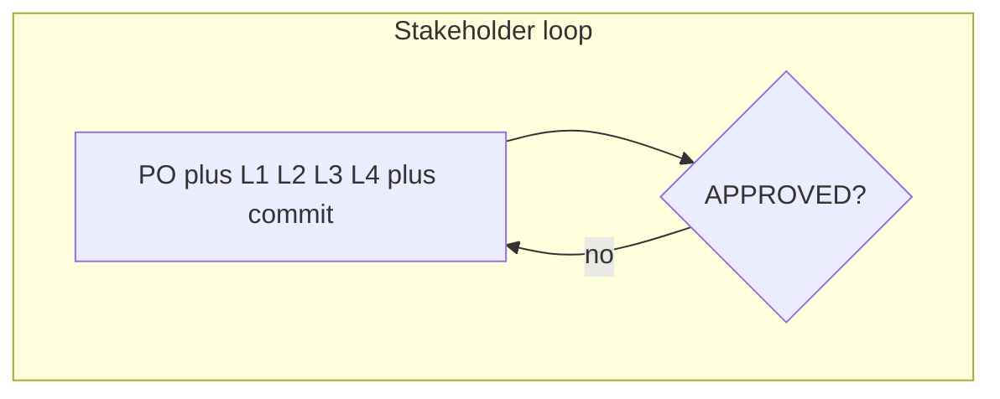

# Loops

Every rework path is a LangChain4j `loopBuilder` with `maxIterations` from the team YAML `policy` block and `testExitAtLoopEnd(true)`. Hitting the cap does not spin: the run ends as `ESCALATED`.



| Loop | Policy field | Default | Exit when |
| --- | --- | --- | --- |
| L1 spec | `maxSpecRework` | 2 | `AiSpec.covers(featureBrief)` |
| L2 impl | `maxImplementationAttempts` | 3 | `BuildResult.success` |
| L3 review | `maxReviewCycles` | 3 | `ReviewVerdict.approved` |
| L4 QA | `maxQaCycles` | 3 | `QaVerdict.passed(qaPassThreshold)` after `QaEvidence.reconcile` |
| Outer | `maxStakeholderCycles` | 2 | `StakeholderDecision.endsCycle()` (approved, empty follow-ups, or no-op “re-run tests”) |

L3 and L4 wrap rework in `conditionalBuilder`: Developer runs only when the previous verdict asked for changes.

Bootstrap empty verdicts so the first Developer pass has something to read:

```java
inputs.put("reviewFeedback", "");
inputs.put("qaFeedback", "");
inputs.put("buildFeedback", "");
inputs.put("reviewVerdict", ReviewVerdict.none());
inputs.put("qaVerdict", QaVerdict.none());
inputs.put("stakeholderDecision", StakeholderDecision.none());
```

Missing roles skip their loop (lean-pair has no QA loop). Caps still apply to the loops that exist.

Sequence diagrams for L3/L4 rework, the outer stakeholder cycle, and human approval: [sequences.md](sequences.md).
