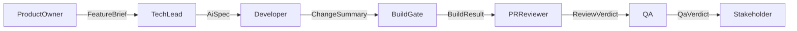

# Roles

Each role is a LangChain4j `@Agent` interface that returns a **record**. Downstream loops branch on typed fields, not prose.

| Role | Interface | Output | Tools |
| --- | --- | --- | --- |
| Product Owner | `ProductOwnerAgent` | `FeatureBrief` | none |
| Tech Lead | `TechLeadAgent` | `AiSpec` | read-only `listFiles`, `readFile` |
| Developer | `DeveloperAgent` | `ChangeSummary` | `listFiles`, `readFile`, `writeFile`, `deleteFile` |
| Build gate | `agentAction` | `BuildResult` | allowlisted `test` command |
| PR Reviewer | `PrReviewerAgent` | `ReviewVerdict` | none (receives `gitDiff`) |
| QA | `QaAgent` | `QaVerdict` | none (receives diff + test output) |
| Stakeholder | `StakeholderAgent` or HITL | `StakeholderDecision` | none |

Default models: PO / QA / Stakeholder use `MODEL_FAST`. Tech Lead / Developer / Reviewer use `MODEL_STRONG`.
Structured roles (PO, Reviewer, QA, Stakeholder) request `json_object`. Reasoning models that put JSON only in `thinking` are unwrapped before parse.

The system prompts in `prompts/` restate each loop's exit condition, because a self-inconsistent verdict makes the loop spin until it runs out of cycles. Keep them aligned when you change a record or a policy:

| Prompt rule | Enforced by |
| --- | --- |
| Every AC id appears once in traceability | `AiSpec.covers(brief)` — spec loop |
| `APPROVE` requires `blockingCount == 0` | `ReviewVerdict.approved()` — review loop |
| `PASS` is derived from per-AC results | `QaVerdict` compact constructor — QA loop |
| `REJECTED` with no `followUps` ends the cycle (run escalates) | `StakeholderDecision.endsCycle()` — stops empty restarts |

## FeatureBrief

Numbered Given/When/Then criteria. Sample: [sample-specs/01-feature-brief.json](sample-specs/01-feature-brief.json).

Public type: `dev.mytechprofile.sdlc.domain.FeatureBrief`.

## AiSpec

Must trace every AC id to a planned test (`AiSpec.covers(brief)`). Sample: [sample-specs/02-ai-spec.json](sample-specs/02-ai-spec.json).

Public type: `dev.mytechprofile.sdlc.domain.AiSpec`.

## ChangeSummary / BuildResult / verdicts

See the rest of [sample-specs/](sample-specs/). Java records live in `sdlc-core` and carry Javadoc with a call sample on the type.
