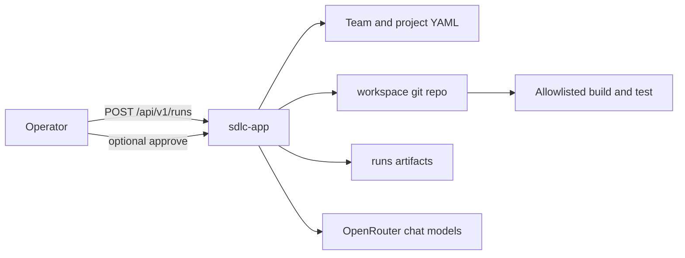
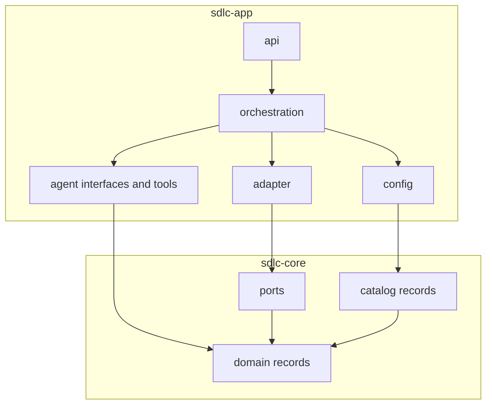
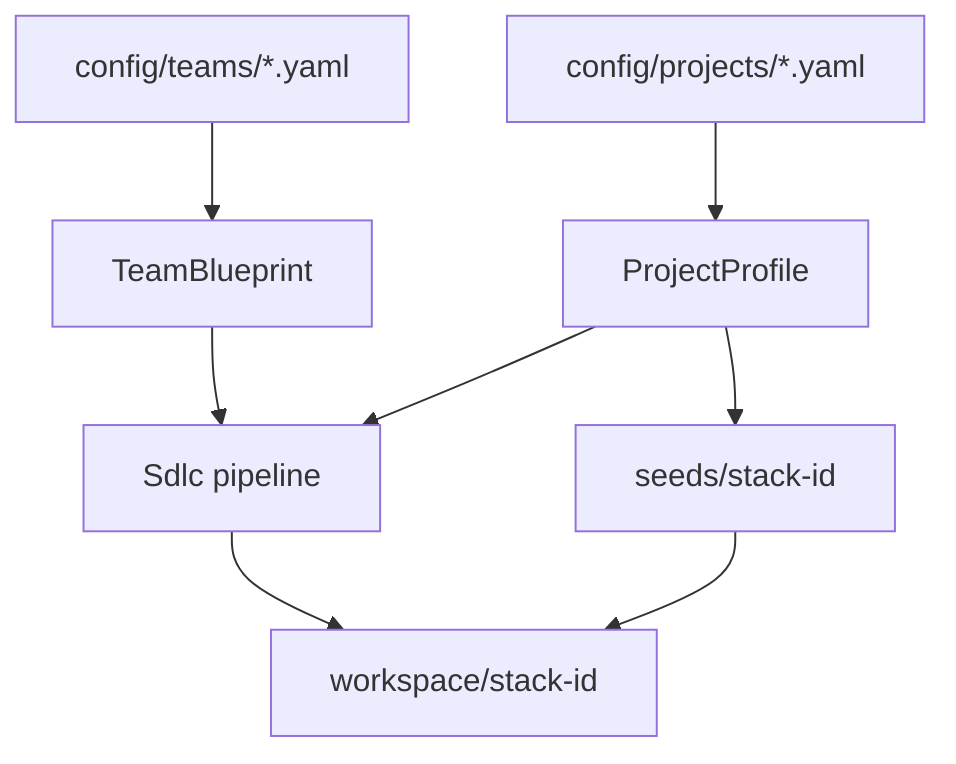
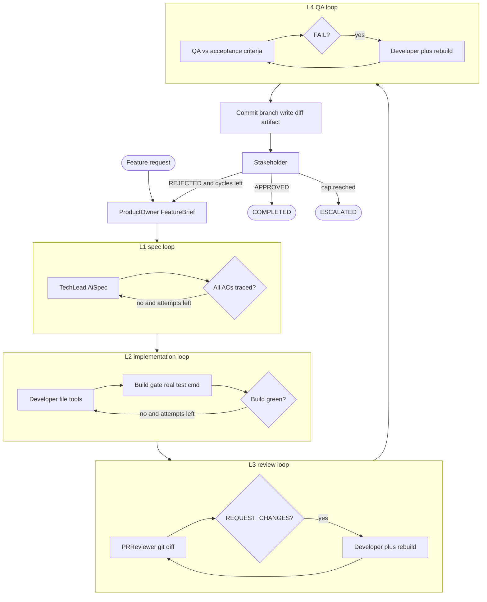
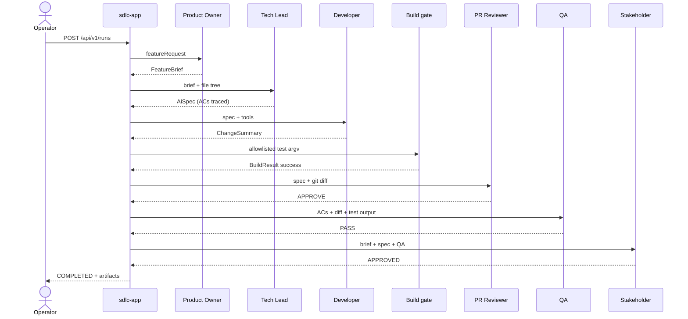
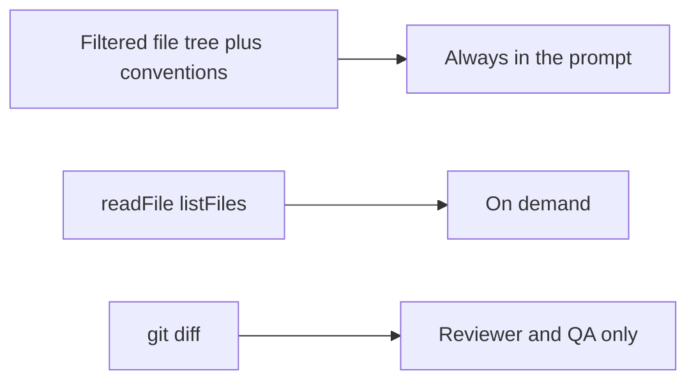
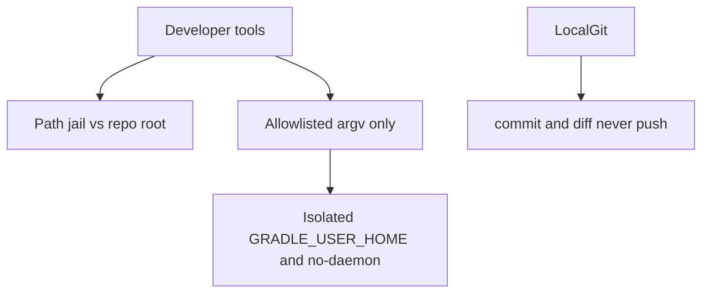

# Architecture

The SDLC app is an orchestrator. It does not contain the users CRUD domain. It loads a **team** YAML and a **project** YAML, copies a **seed** into a gitignored workspace, and runs six roles (or a subset) as a LangChain4j agentic graph. The Developer writes real files. A deterministic build gate runs the project's allowlisted test command.

## System context

## Modules

`sdlc-core` has **no** LangChain4j or Spring dependency. `sdlc-app` wires agents, adapters, and HTTP.

| Path | Responsibility |
| --- | --- |
| `sdlc-core/.../domain` | `FeatureBrief`, `AiSpec`, verdicts, `RunOutcome` |
| `sdlc-core/.../catalog` | `TeamBlueprint`, `ProjectProfile`, `TeamPolicy` |
| `sdlc-core/.../port` | `WorkspacePort`, `CommandRunner`, `VersionControlPort`, `ArtifactStore` |
| `sdlc-app/.../agent` | `@Agent` interfaces plus Developer/Tech Lead tools |
| `sdlc-app/.../orchestration` | `SdlcOrchestrator`, `SdlcPipelineFactory`, run service |
| `sdlc-app/.../adapter` | Path-jailed files, argv runner, local git, artifact store |
| `sdlc-app/.../config` | YAML catalogs, prompts, model factory, seeder |
| `sdlc-app/.../api` | REST + SSE + dashboard |

## Team vs technology

Java code does not mention Gradle, npm, or users-CRUD. Those live in project YAML. Who is on the team lives in team YAML.

Two independent axes:

| Axis | File | Change when |
| --- | --- | --- |
| Team | `config/teams/<id>.yaml` | Different roles, models, loop caps |
| Technology | `config/projects/<id>.yaml` + `seeds/<id>/` | Different language, build, repo |

## Pipeline and loops

LangChain4j builders:

| Stage | Builder | Exit |
| --- | --- | --- |
| Outer cycle | `loopBuilder` | stakeholder `APPROVED` or `maxStakeholderCycles` |
| L1 spec | `loopBuilder` | `AiSpec.covers(brief)` |
| L2 impl | `loopBuilder` | `BuildResult.success` |
| L3 review | `loopBuilder` + `conditionalBuilder` | `ReviewVerdict.approved` |
| L4 QA | `loopBuilder` + `conditionalBuilder` | `QaVerdict.passed(threshold)` |
| Build / commit / diff | `agentAction` | not an LLM |

Missing roles are skipped (lean pair can omit QA and Stakeholder). See [loops.md](loops.md). Time-ordered views (dashboard, create team/project, happy path, rework, human approval) are in [sequences.md](sequences.md).

## Sequence: happy path

Operator starts a run; artifacts land under `runs/<id>/`; git never pushes.

## How agents see the repo

Never dump the whole tree into a prompt.

## Safety

- Paths resolve with `toRealPath()`; escapes and outbound symlinks throw `PathJailException`.
- Commands are argv arrays from project YAML. The agent cannot invent a shell string.
- Nested Gradle gets `--no-daemon` and `workspace/.gradle-home`.
- Secrets stay in env (`OPENROUTER_API_KEY`).

## Run artifacts

Each run writes `runs/<runId>/`:

| File | Producer |
| --- | --- |
| `01-feature-brief.json` | Product Owner |
| `02-ai-spec.json` | Tech Lead |
| `03-change-summary.json` | Developer |
| `04-build-result.json` | Build gate |
| `05-review-verdict.json` | PR Reviewer |
| `06-qa-verdict.json` | QA |
| `07-pull-request.diff` | Local git |
| `08-stakeholder-decision.json` | Stakeholder or human gate |
| `run.json` | Timeline + status |

Worked examples: [sample-specs/](sample-specs/).

## HTTP

| Method | Path | When |
| --- | --- | --- |
| `POST` | `/api/v1/runs` | Start a feature |
| `GET` | `/api/v1/runs/{id}` | Poll status and artifacts |
| `GET` | `/api/v1/runs/{id}/events` | SSE step stream |
| `POST` | `/api/v1/runs/{id}/approve` | Human stakeholder |
| `GET` | `/api/v1/teams` | Loaded blueprints |
| `POST` | `/api/v1/teams` | Create team YAML from the dashboard |
| `PUT` | `/api/v1/teams/{id}` | Update team YAML |
| `GET` | `/api/v1/projects` | Loaded profiles |
| `POST` | `/api/v1/projects` | Create project YAML from the dashboard |
| `PUT` | `/api/v1/projects/{id}` | Update project YAML |
| `POST` | `/api/v1/workspace/seed` | Copy seed into `workspace/` |

Call-level sequences for these endpoints: [sequences.md](sequences.md).

## Public types

See [roles.md](roles.md) for the record contracts. Javadoc on every public type in `sdlc-core` and `sdlc-app` includes a sample. `./gradlew check` enforces `MissingJavadocType` for public classes.
