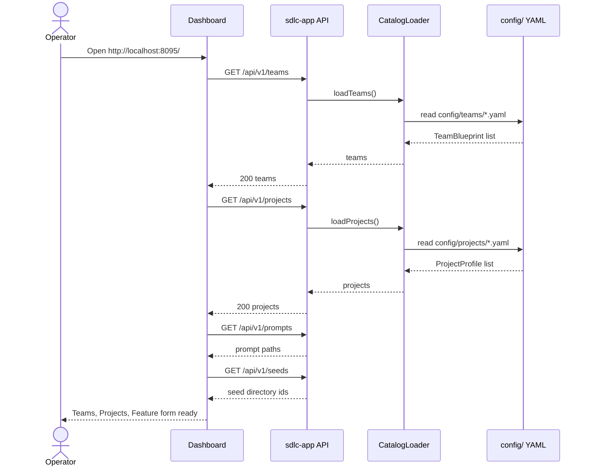
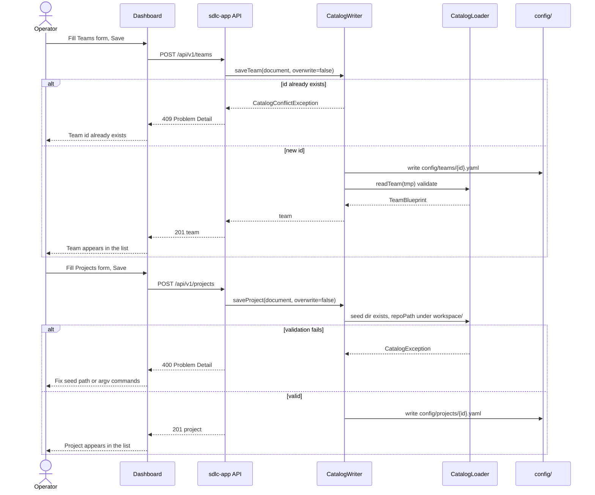
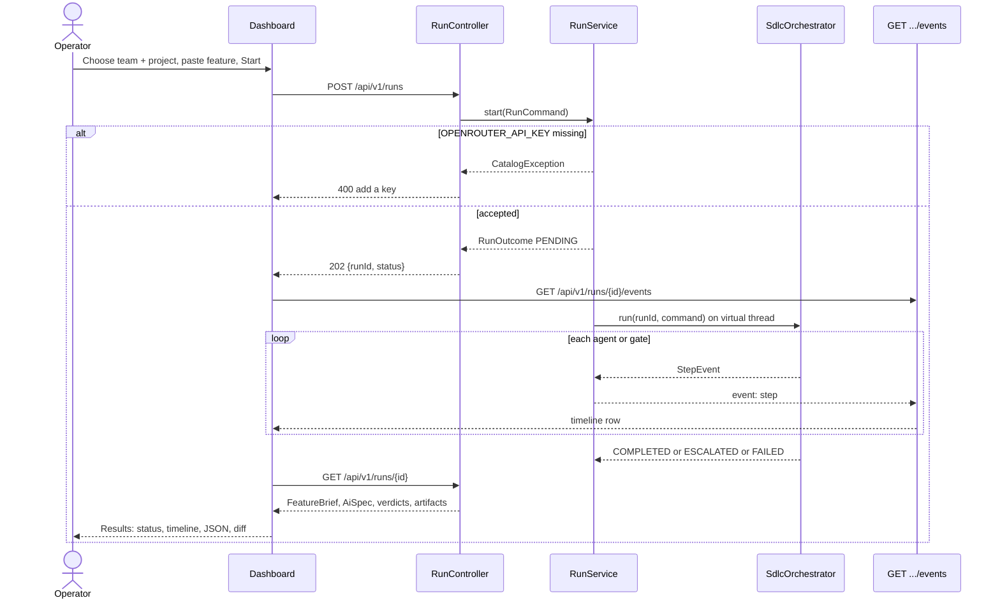
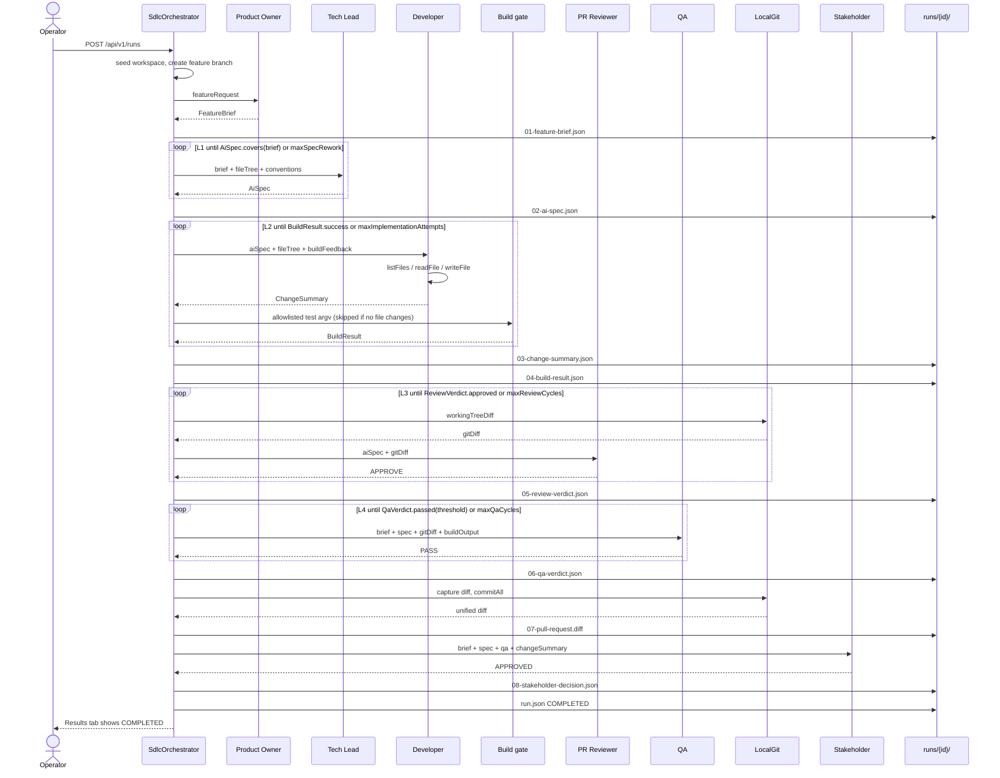
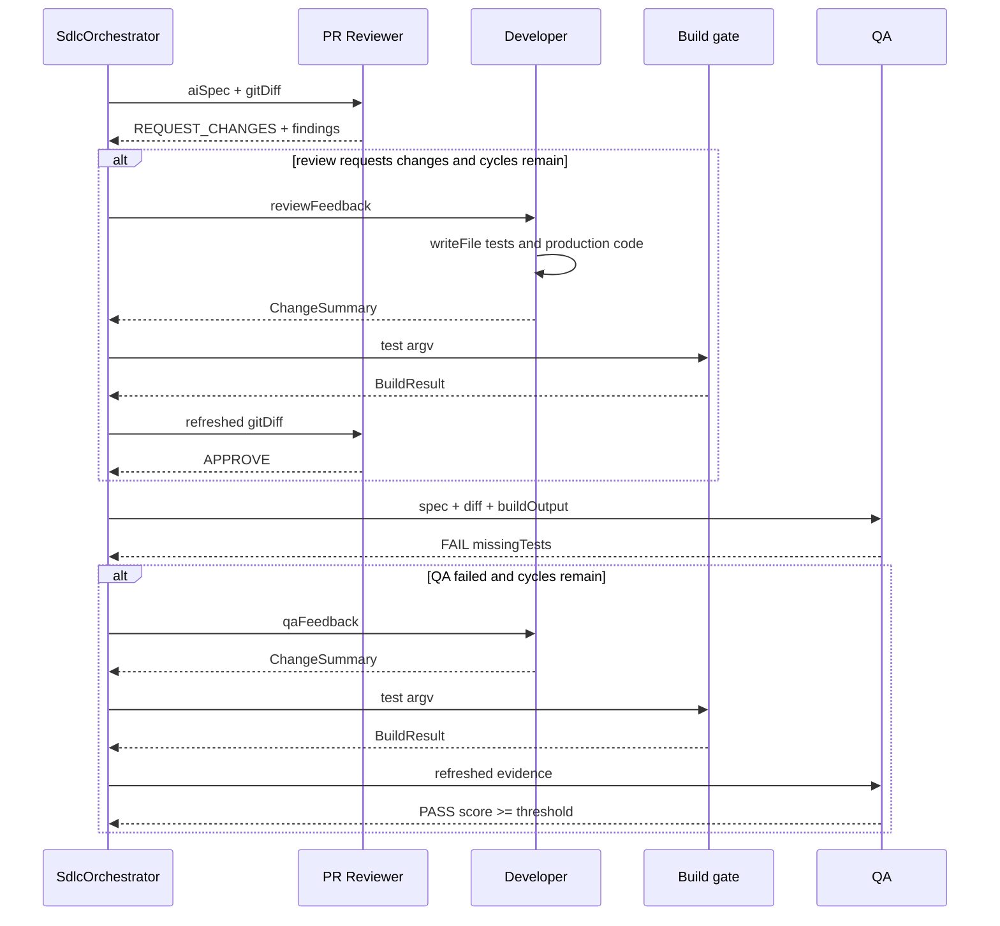
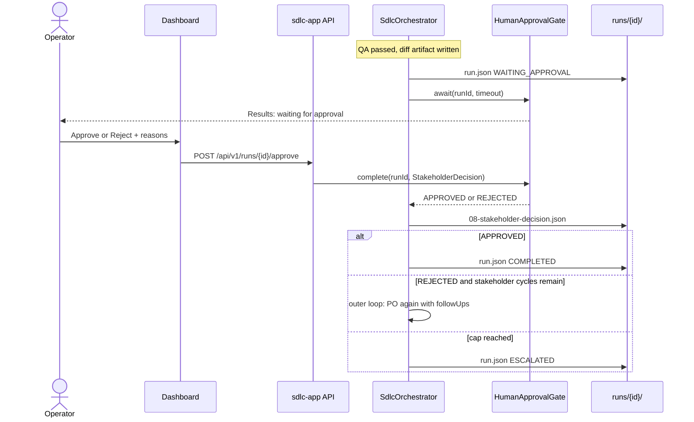
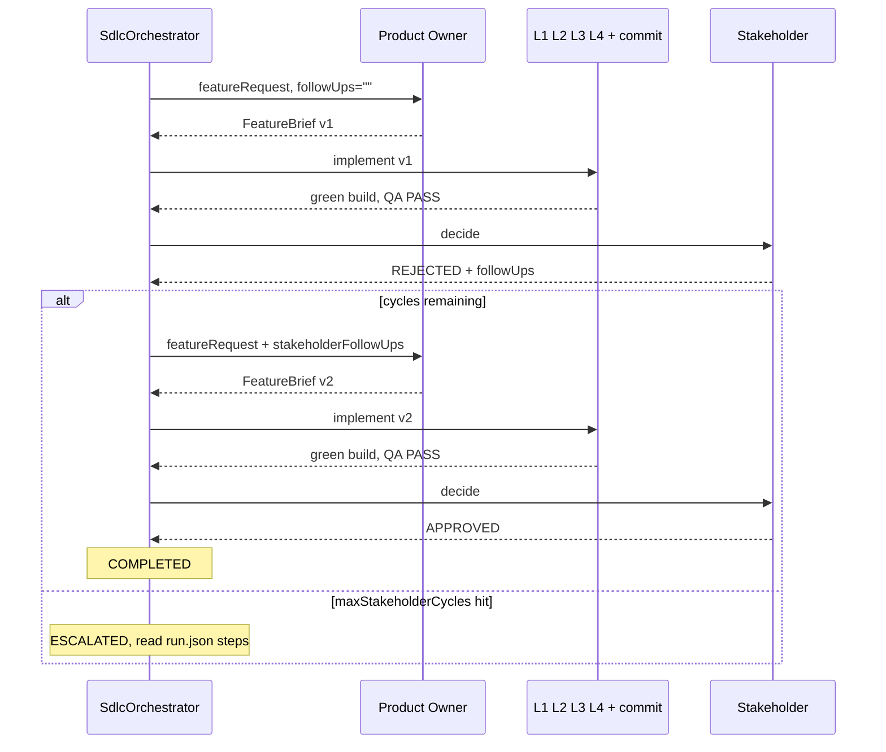
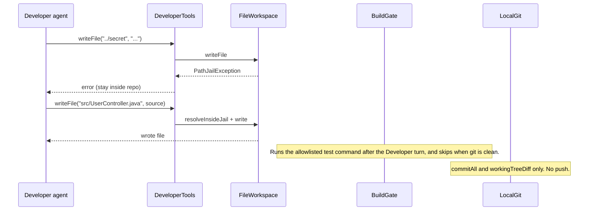
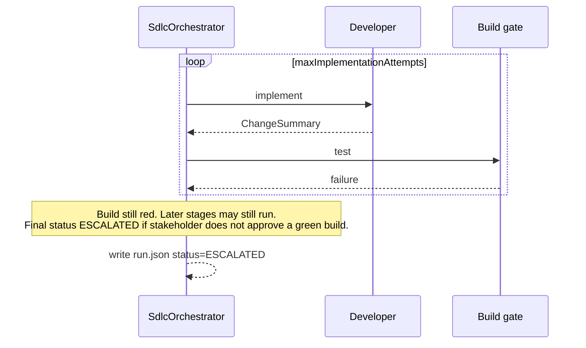

# Sequence diagrams

Time-ordered views of the dashboard, catalog writes, and the SDLC pipeline. Flowcharts for the same loops live in [architecture.md](architecture.md) and [loops.md](loops.md).

Participants use the names the operator sees in the UI and `runs/<id>/run.json`.

## 1. Dashboard: list teams and projects

On load, the UI fills the Samples, Teams, and Projects tabs from the catalog.

## 2. Create a team or a project

Creates persist YAML under `config/`. No Java change. The next `GET` (and the next run) sees the new id without restarting, because `CatalogLoader` re-reads disk.

Update uses `PUT /api/v1/teams/{id}` and `PUT /api/v1/projects/{id}` with `overwrite=true`.

## 3. Start a feature and watch results

The Samples tab starts a numbered recipe, posts a run, then the Results tab follows SSE plus a final `GET`.

Optional before Start: **Seed workspace** calls `POST /api/v1/workspace/seed` so `workspace/<projectId>` exists before the first Developer write.

## 4. Happy path (default-scrum-team)

One stakeholder cycle. Every AC is traced, tests pass, review and QA approve, stakeholder ships. Missing roles are omitted (see lean-pair in [adding-a-team.md](adding-a-team.md)).

## 5. Review or QA asks for changes

L3 and L4 wrap Developer + build gate in `conditionalBuilder`. The Developer runs only when the previous verdict is not a pass.

## 6. Human stakeholder

When team YAML has `stakeholderMode: HUMAN`, the pipeline pauses at `WAITING_APPROVAL`. The Results tab shows Approve / Reject.

Agent stakeholder mode skips this gate: the Stakeholder LLM writes `08-stakeholder-decision.json` directly.

## 7. Stakeholder rejects (outer loop)

`maxStakeholderCycles` bounds how many times the whole inner sequence may repeat.

## 8. Developer tools and safety

The Developer never receives a shell string. Paths that leave the repo root fail. Git never pushes.

## 9. Loop cap without a passing verdict

Any `loopBuilder` that exhausts `maxIterations` without its exit condition leaves the run `ESCALATED`, not spinning.

## How to read these against code

| Diagram | Start here |
| --- | --- |
| 1–3 Dashboard and runs | `sdlc-app/.../api`, static `/` |
| 4–7 Pipeline and HITL | `SdlcOrchestrator`, [loops.md](loops.md) |
| 8 Safety | `FileWorkspace`, `ProcessCommandRunner`, `LocalGit` |
| Artifacts on disk | `runs/<runId>/`, [sample-specs/](sample-specs/) |
