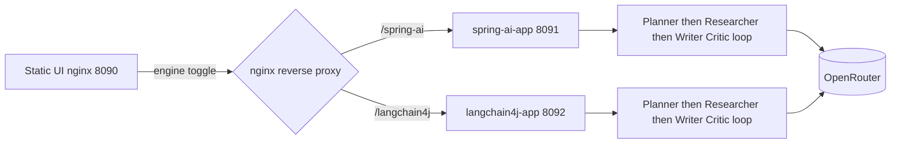

# Architecture

## Scenario

Both engines run the same research pipeline:

1. **Planner** — structured list of research questions (depth 1–5)
2. **Researcher** — one structured call → `ResearchFindings` (OpenRouter `:online` model)
3. **Writer** — markdown report from `ResearchFindings` (+ optional critique notes)
4. **Critic** — score + notes; loop with writer until score ≥ threshold or max revisions

No database. State lives in the in-flight request / LangChain4j `AgenticScope`.

Pass/fail for the critic loop uses config `research.pass-threshold`. Domain `Critique` is `{ score, notes }` only (`Critique.passes(threshold)` / `Critique.none()`).

## Topology



## Modules

| Path | Role | Deep dive |
|---|---|---|
| `spring-ai-app/` | Explicit Spring AI orchestration | [spring-ai-app/docs/architecture.md](../spring-ai-app/docs/architecture.md) |
| `langchain4j-app/` | Declarative `langchain4j-agentic` orchestration | [langchain4j-app/docs/architecture.md](../langchain4j-app/docs/architecture.md) |
| `ui/` | Static HTML + Tailwind CDN + nginx proxy | — |
| `shared-fixtures/` | JSON contract fixture for both apps | — |
| `shared-prompts/` | Identical system prompts copied into both apps' `classpath:prompts/` | [configuration.md](configuration.md#shared-prompts) |
| `docker/` | Temurin 26 multi-stage Dockerfile | — |

## Shared packaging (both apps)

Each app mirrors the same layers so the comparison stays about orchestration style, not structure:

```
api/             ResearchRequest, EngineMeta, ResearchController, ApiExceptionHandler
domain/          Critique, Finding, ResearchFindings, ResearchPlan, ResearchReport, StepEvent, ResearchRole, ResearchCommand
agents/          role ports / @Agent interfaces (+ Spring AI ChatClient impls); researcher/writer share ResearchFindings
config/          ResearchProperties, model/client beans, PromptResources, AppConfig
orchestration/   ResearchOrchestrator (+ StepTrace or StepCollectingListener / ReportAssembler)
```

| Layer | May depend on |
|---|---|
| `api` | `domain`, `orchestration`, `config` |
| `orchestration` | `agents`, `domain`, `config` |
| `agents` | `domain` (+ `config` for Spring AI prompt/ChatClient wiring) |
| `domain` | nothing else in the app |

Controllers map `ResearchRequest` → `ResearchCommand`. Orchestrators accept `run(command)` or `run(command, Consumer<StepEvent>)` so SSE never reaches into collectors from the web layer.

## Shared REST contract

| Method | Path | Purpose |
|---|---|---|
| `GET` | `/api/v1/meta` | Engine identity |
| `POST` | `/api/v1/research` | Full report |
| `GET` | `/api/v1/research/stream` | SSE `step` + `report` events |
| `GET` | `/actuator/health` | Compose healthcheck |

`ResearchReport` fields: `topic`, `plan`, `findings`, `draft`, `critique`, `finalReport`, `steps`, `engine`, `model`, `elapsedMs`.

`critique` JSON: `{ "score": number, "notes": string }` (no embedded threshold).

`steps[]` JSON: `{ "agent", "status", "input", "output", "elapsedMs" }` — `input` / `output` are human-readable texts for the UI timeline.

Contract fixture: [`shared-fixtures/research-report.contract.json`](../shared-fixtures/research-report.contract.json).
