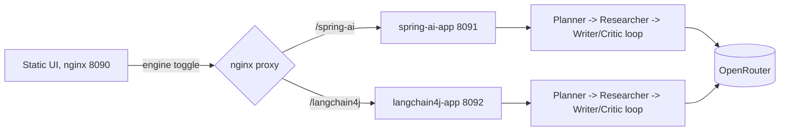

# Spring AI vs LangChain4j — implementation plan

> Historical plan used to scaffold the project. For the current package layout, shared prompts, and API shape, prefer [architecture.md](architecture.md) and the module docs under `spring-ai-app/docs/` and `langchain4j-app/docs/`.

Build two Spring Boot 4.1 / Java 26 apps that run the identical planner-researcher-writer-critic pipeline behind the identical REST contract, one on Spring AI 2.0 and one on LangChain4j 1.18.1, fronted by one static UI with an engine toggle, all wired through OpenRouter and Docker Compose.

Directory `learning-with-me/spring-langchain4j/`, Gradle Groovy DSL, Java 26, no database.

## Scenario both engines implement

A multi-agent research pipeline. Four agents, same prompts and same model in both apps:

- **Planner** decomposes a topic into 3-5 research questions (structured output).
- **Researcher** answers each question using OpenRouter's `:online` model suffix for real web search (no second API key).
- **Writer** turns findings into a markdown report.
- **Critic** scores the draft and returns revision notes; writer/critic run as a bounded loop (max 2 revisions, exit when score meets threshold).



## Shared contract (byte-identical in both apps)

- `POST /api/v1/research` returns the full `ResearchReport`
- `GET /api/v1/research/stream` Server-Sent Events, one event per agent step
- `GET /api/v1/meta` returns engine id, framework version, model names
- `GET /actuator/health` for Compose healthchecks

Records duplicated identically in each app (no shared Java module, so each stays a standalone reference): `ResearchRequest(topic, depth)`, `ResearchReport(topic, plan, findings, draft, critique, finalReport, steps, engine, model, elapsedMs)`, `StepEvent(agent, status, output, elapsedMs)`. Domain types live in `domain/`; transport types stay in `api/`. `Critique` is `{ score, notes }` (threshold stays in config).

## Engine differences (the point of the exercise)

- **Spring AI 2.0**: no dedicated orchestration API, so orchestration is explicit code following the Building Effective Agents patterns. Four single-method role ports with ChatClient implementations, `.entity(ResearchPlan.class)` for structured output, and a hand-written `ResearchOrchestrator` holding the sequence and the loop. Steps published through `StepTrace` / `Consumer<StepEvent>`.
- **LangChain4j 1.18.1**: declarative. `@Agent(description=..., outputKey=...)` interfaces, composed with `AgenticServices.sequenceBuilder(...)` and `AgenticServices.loopBuilder()` plus `maxIterations` and an exit condition. Agents + review loop are Spring beans; the outer sequence is assembled per request. Per-step events come from `AgentListener` with `inheritedBySubagents()` returning true (timing keyed by `agentId`).

Use plain `langchain4j-open-ai` and `langchain4j-agentic` with models built in a `@Configuration`, **not** the LangChain4j Spring Boot starter, to avoid autoconfiguration risk against Boot 4.1. Tradeoff: a few lines of manual bean wiring instead of properties.

System prompts are shared text under `shared-prompts/` and copied into both apps as `classpath:prompts/` so engine comparisons stay fair.

## Layout

```
spring-langchain4j/
  settings.gradle, build.gradle, gradlew, gradle/wrapper   Gradle 9.4.1, toolchain 26
  .java-version (26), .env.example, .gitignore, README.md
  docs/README.md, docs/architecture.md, docs/configuration.md, docs/plan.md
  shared-fixtures/           research-report.contract.json
  shared-prompts/            *.system.txt (packaged into both apps)
  docker/Dockerfile          parameterized MODULE arg, Temurin 26
  docker-compose.yml
  spring-ai-app/             Boot 4.1.0 + Spring AI 2.0.0 BOM, port 8091
  langchain4j-app/           Boot 4.1.0 + LangChain4j 1.18.1 BOM, port 8092
  ui/                        index.html, app.js, nginx.conf, Dockerfile, port 8090
```

Ports 8090-8092 avoid the existing `java-mcp` (8080, 9080-9082) and `agents-2-agents` (8080, 8081) allocations.

## Configuration

Single required secret, `OPENROUTER_API_KEY`, enforced in Compose with `${OPENROUTER_API_KEY:?}` per repo convention.

- Spring AI: `spring.ai.openai.api-key`, `base-url`, `chat.options.model`
- LangChain4j: same env vars bound via `@ConfigurationProperties`
- `OPENROUTER_CHAT_MODEL` default `openai/gpt-4o-mini`, `OPENROUTER_RESEARCH_MODEL` default `openai/gpt-4o-mini:online`
- `OPENROUTER_MAX_TOKENS` default `4096` → `research.max-tokens` on both engines

## UI

One `index.html` with Tailwind via CDN and vanilla JS, served by `nginx:1.27-alpine` which also reverse-proxies `/spring-ai/*` and `/langchain4j/*` to the two apps, so there is no CORS configuration. Features: topic input, depth select, engine toggle, live step timeline over SSE, rendered final report, and a compare mode that runs both engines and shows elapsed time per agent side by side. Semantic HTML, `role="status"` on loading regions, keyboard-accessible controls, visible focus, and explicit loading, empty, and error states.

## Tests

Each app gets a fake `ChatModel` (no network) asserting agent order, that the critic loop stops at `maxIterations`, that it exits early on a passing score, and that the emitted step trace is complete. Plus a JSON contract test in each app asserting the response serializes to the same shared fixture, which is what actually guarantees the two engines are interchangeable behind the UI.

Verification: `jenv shell 26` then `./gradlew check` from the project root.
