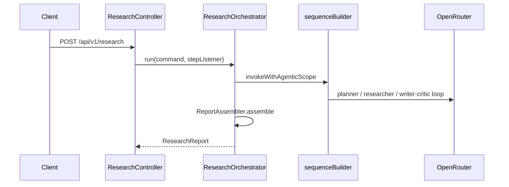

# langchain4j-app architecture

Spring Boot **4.1** / Java **26** / LangChain4j **1.18.1** (`langchain4j-agentic` **1.18.1-beta28**) implementation of the shared research pipeline.

Port: **8092**. OpenRouter via manual `OpenAiChatModel` beans (no LangChain4j Spring Boot starter).

Parent overview: [../../docs/architecture.md](../../docs/architecture.md).

## Design idea

LangChain4j’s agentic module provides **declarative** orchestration:

- `@Agent` interfaces with `outputKey` for each role
- Shared system prompts from `classpath:prompts/` (same files as Spring AI)
- Agents + writer/critic loop built once as Spring beans
- Outer `sequenceBuilder` assembled per request with a fresh `StepCollectingListener`
- `AgentListener` (`inheritedBySubagents=true`) for per-step SSE / report events
- Shared mutable `AgenticScope` carries `plan`, `findingsDoc`, `draft`, `critique`

## Package map

```
dev.mytechprofile.research.langchain4j
├── Langchain4jResearchApplication
├── agents/              @Agent interfaces (Planner, Researcher, Writer, Critic)
├── api/                 ResearchRequest, EngineMeta, ResearchController, ApiExceptionHandler
├── domain/              Critique, Finding, ResearchPlan, ResearchFindings, ResearchReport, StepEvent, ResearchRole, ResearchCommand
├── config/              ResearchProperties, Langchain4jConfig, ResearchPipelineConfig, AppConfig, PromptResources
└── orchestration/
    ├── ResearchOrchestrator     invokes sequence, attaches listener
    ├── ReportAssembler          AgenticScope → ResearchReport
    └── StepCollectingListener   AgentListener → StepEvent (agentId timing)
```

| Layer | May depend on |
|---|---|
| `api` | `domain`, `orchestration`, `config` |
| `orchestration` | `agents`, `domain`, `config` |
| `agents` | `domain` |
| `domain` | nothing in this app |

| Type | Responsibility |
|---|---|
| `PlannerAgent` | `outputKey=plan` → `ResearchPlan` |
| `ResearcherAgent` | `outputKey=findingsDoc` → `ResearchFindings` (online model) |
| `WriterAgent` | `outputKey=draft` → markdown `String` |
| `CriticAgent` | `outputKey=critique` → `Critique` |
| `ResearchPipelineConfig` | Singleton agents + review loop |
| `ResearchOrchestrator` | Per-request sequence + invoke + assemble |
| `StepCollectingListener` | Role normalize via `ResearchRole`; timing keyed by `agentId`; records input/output text |
| `ReportAssembler` | Map scope → `ResearchReport` |

`ResearchFindings` is the shared researcher/writer domain shape in both apps (same exercise). LangChain4j also needs a POJO root because its collection output parser does not accept a bare `List`.

## Request flow



## AgenticScope keys

| Key | Type | Producer |
|---|---|---|
| `topic` / `depth` | input | orchestrator |
| `critique` | `Critique` | seeded with `Critique.none()`, then critic |
| `plan` | `ResearchPlan` | planner |
| `findingsDoc` | `ResearchFindings` | researcher |
| `draft` | `String` | writer |

## Testing

- `ResearchOrchestratorFakeModelTest` — scripted `ChatModel`, asserts step names and revision limits
- `StepCollectingListenerTest` — tracked roles + nested agentId timing
- `ResearchReportContractTest` — shared JSON fixture field shape (`critique` has `score` + `notes` only)

Also see [../../docs/configuration.md](../../docs/configuration.md) for env vars, thresholds, and shared prompts.
