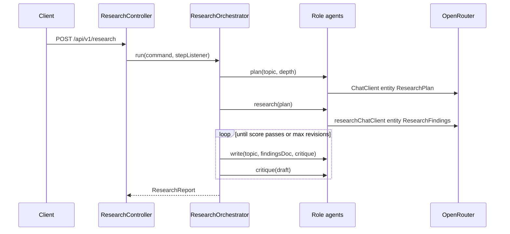

# spring-ai-app architecture

Spring Boot **4.1** / Java **26** / Spring AI **2.0** implementation of the shared research pipeline.

Port: **8091**. OpenRouter via `spring-ai-starter-model-openai`.

Parent overview: [../../docs/architecture.md](../../docs/architecture.md).

## Design idea

Spring AI 2.0 has no dedicated multi-agent orchestration API. This app follows Anthropic’s *Building Effective Agents* patterns with **explicit Java control flow**:

- One role port + ChatClient implementation per agent (planner, researcher, writer, critic)
- Shared system prompts from `classpath:prompts/` (same files as LangChain4j)
- Structured output via `.entity(...)` — researcher returns `ResearchFindings` (same domain object as LangChain4j)
- A hand-written `ResearchOrchestrator` owns sequence + writer/critic loop
- Per-request `StepTrace` publishes step events for the report and SSE

## Package map

```
dev.mytechprofile.research.springai
├── SpringAiResearchApplication
├── api/                 ResearchRequest, EngineMeta, ResearchController, ApiExceptionHandler
├── domain/              Critique, Finding, ResearchFindings, ResearchPlan, ResearchReport, StepEvent, ResearchRole, ResearchCommand
├── agents/              role ports + ChatClient* implementations
├── config/              ResearchProperties, ChatClientConfig, AppConfig, PromptResources
└── orchestration/
    ├── ResearchOrchestrator     sequence + loop
    └── StepTrace                step event collector
```

| Layer | May depend on |
|---|---|
| `api` | `domain`, `orchestration`, `config` |
| `orchestration` | `agents`, `domain`, `config` |
| `agents` | `domain`, `config` |
| `domain` | nothing in this app |

| Type | Responsibility |
|---|---|
| `ResearchController` | `GET /meta`, `POST /research`, `GET /research/stream` (SSE) |
| `PlannerAgent` / `ResearcherAgent` / `WriterAgent` / `CriticAgent` | Single-method role ports (ISP) |
| `ChatClient*Agent` | ChatClient implementations; researcher uses `researchChatClient` and one-shot `.entity(ResearchFindings.class)`; writer takes `ResearchFindings` |
| `ResearchOrchestrator` | Explicit pipeline orchestration; accepts `Consumer<StepEvent>` |
| `StepTrace` | Thread-safe step list with input/output text + optional listeners |
| `ResearchProperties` | engine id, models, thresholds, default depth, SSE timeout, `maxTokens` |

## Request flow



## OpenRouter wiring

`spring.ai.openai.*` points at OpenRouter. `ChatClientConfig` exposes:

- `chatClient` — default chat model + `OpenAiChatOptions.maxTokens` from `research.max-tokens`
- `researchChatClient` — same base options with model override to `OPENROUTER_RESEARCH_MODEL` (`:online`)

Agents never import OpenAI option types. Shared env/property docs: [../../docs/configuration.md](../../docs/configuration.md).

## Testing

- `ResearchOrchestratorTest` — fake role ports (lambdas), asserts step order and revision limits
- `ResearchFindingsTest` — domain wrapper for structured researcher output
- `ResearchReportContractTest` — shared JSON fixture field shape (`critique` has `score` + `notes` only)

Also see [../../docs/configuration.md](../../docs/configuration.md) for env vars, thresholds, max tokens, and shared prompts.
